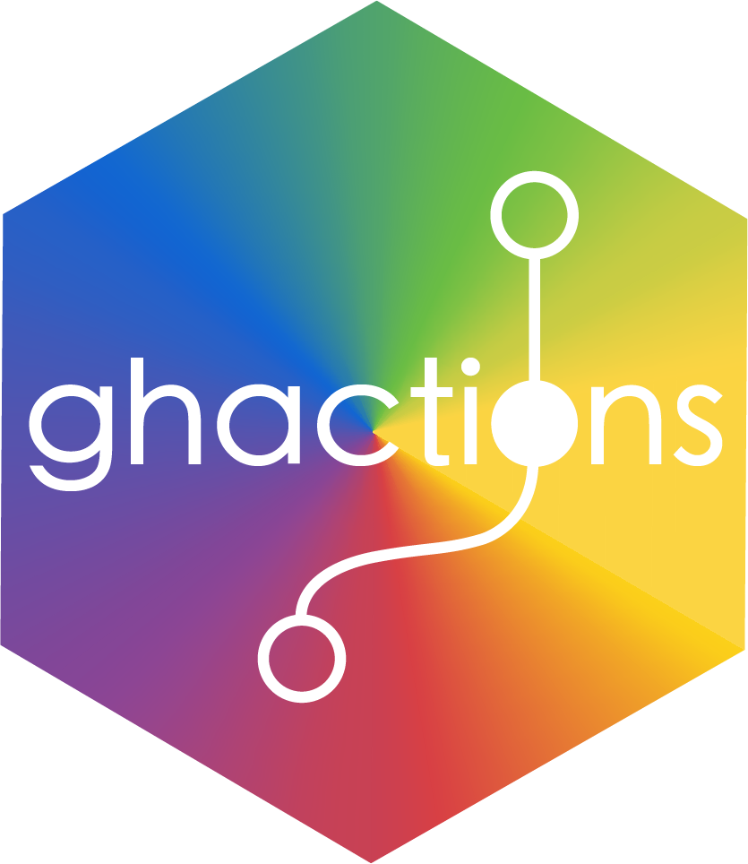
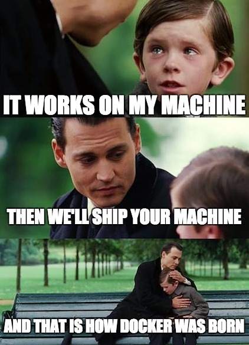

<div class="columns two">
<div>
  <h2>GitHub Actions for R</h2>
  Max Held
  <p class="note">
  <i class="fas fa-link"></i> <a href=http://www.maxheld.de>http://www.maxheld.de</a> <br>
  <i class="fab fa-github"></i> @maxheld83 <br>
  <i class="fab fa-twitter"></i> @maxheld
  </p>
</div>
<div>
  
</div>
<figcaption class="copyright bottom">RStudio Inc. / Friedrich-Alexander Universität Erlangen Nürnberg</figcaption
</div>
</section>


<section class="slide clear">
<h2 class="shout">
  What is <br>Continuous Integration and Delivery (<strong>CI/CD</strong>)?
</h2>
</section>


<section class="slide black clear">
<figure>
  
  <figcaption class="copyright white">
  The Big Lebowski (1998) / <a href=https://me.me/i/but-it-works-on-my-machine-works-defect-software-meme-b5fc63057ac24e8dbdcfa4ef52e24d6f>http://www.picturesso.com</a> 
  </figcaption>
<figcaption class="copyright bottom">
Copyright © 3000 <a href="">Yours Truly</a>, Famous Inc.
</figcaption>
</figure>
</section>


<section class="slide">
<h2>Without CI/CD</h2>

```{r echo=FALSE, out.height="25%", out.width="100%"}
DiagrammeR::grViz(diagram = "assets/cicd-wo.gv")
```

<h2>With CI/CD</h2>

```{r echo=FALSE, out.height="25%", out.width="100%"}
DiagrammeR::grViz(diagram = "assets/cicd-with.gv")
```
</section>


<section class="slide">

<h2>GitHub Actions in Action</h2>

<pre class="R">
  <code>remotes::install_github("r-lib/ghactions")</code>
  <code>ghactions::use_ghactions(</code>
  <code>    workflow = ghactions::website()</code>
  <code>)</code>
<pre>
<br>
<pre class="bash">
  <code>git add .</code>
  <code>git commit -m "update project"</code>
  <code>git push</code>
</pre>


</section>


<section class="slide clear">


</section>

<section class="slide black clear">
<figure>
  
</figure>
</section>


<section class="slide clear">
<h2 class="shout">
  Is it <strong>easy <br>to reason about</strong>?
</h2>
</section>


<section class="slide clear">
<h2 class="shout">
  Definition of the <strong>Computing Environment</strong>
</h2>
</section>


<section class="slide">
<div class="columns two">
<div>
  <h2><code>Dockerfile</code></h2>
  <pre class="Dockerfile">
  <code>FROM rhub/debian-gcc-release</code>
  ...
  <code>ENTRYPOINT ["/entrypoint.R"]</code>
  </pre>

  <pre class="bash">
  <code>docker build \</code>
  <code>  --tag install-deps .</code>
  <code>docker run \</code>
  <code>  --entrypoint R install-deps</code>
  </pre>
</div>
<div>
  <h2><code>.travis.yml</code></h2>
  <pre class="yaml">
  <code>language:r</code>
  <code>cache: packages</code>
  ...
  <code>deploy:</code>
  <code>  provider: script</code>
  <code>    script: Rscript -e \</code> <code>      'pkgdown::deploy_site_github(verbose = TRUE)'</code>
  </pre>
  </div>
</div>
</section>


<section class="slide">
<h2>What GitHub does ...</h2>
<pre>
  <code>action "Deploy to shinyapps.io" {</code>
  <code>  uses = "maxheld83/shinyapps<mark class="important">@master"</mark></code>
  <code>  secrets = [<mark>"SHINYAPPS_SECRET"</mark>, SHINYAPPS_TOKEN"]</code>
  <code>}</code>
</pre>
<h2>.. you can do too!</h2>
<pre class="bash">
  <code>docker run <mark>--env "SHINYAPPS_SECRET=foo"</mark> \ </code>
  <code>  --volume ${PWD}:${HOME} maxheld83/shinyapps<mark class=important>:master</mark></code>
</pre>
</section>

<!-- TODO gif of 1+1 or it did not happen -->


<section class="slide clear">
<h2 class="shout">Definition of the <strong>Workflow Graph</strong></h2>
</section>


<section class="slide">
<pre>
  <code>workflow "Deploy Shiny App" {</code>
  <code>  on = <mark>"push"</mark></code>
  <code>  resolves = [<mark class="important">"Deploy to shinyapps.io"</mark>]</code>
  <code>}</code>
  <code>action <mark>"Install Dependencies"</mark> {</code>
  <code>  uses = "r-lib/ghactions/install-deps"</code>
  <code>}</code>
  <code>action <mark class="important">"Deploy to shinyapps.io"</mark>{</code>
  <code>  uses = "maxheld83/shinyapps@master"</code>
  <code>  needs = [<mark>"Install Dependencies"</mark>]</code>
  <code>}</code>
</pre>

</section>


<section class="slide">
<h2>Isolation is a Good Thing</h2>
</section>


<section class="slide clear" id="ecosystem">
<h2 class="shout">Definition of the <br> <strong>API Ecosystem</strong></h2>
</section>

<section class="slide black clear">
<figure>
  
  <figcaption class="copyright white">
  Finding Neverland (2004)
  </figcaption>
<figcaption class="copyright bottom">
Copyright © 3000 <a href="">Yours Truly</a>, Famous Inc.
</figcaption>
</figure>
</section>


<section class="slide clear">
<h2 class="shout">
  It's <strong>easier(ish)</strong> <br>
  to reason about.
</h2>
</section>


<section class="slide">
<h2>Caveats </h2>

😒 No native caching.

</section>


<section class="slide">
<h2>🖖Thanks❤️</h2>

Jim Hester
<p class="note">RStudio Inc.</p>
Gabor Csardi
<p class="note">The R-Hub Project / R Consortium</p>
Dirk Edelbuettel & Carl Boettiger
<p class="note">The Rocker Project</p>
</section>


<section class="slide">
<h2>Get Started with Actions for R 👟️</h2>

Sign up for the beta at <a href=http://www.github.com/actions>github.com/actions</a>.

<pre class="R">
<code>remotes::install_github(<mark>"r-lib/ghactions"</mark>)</code>
</pre>

<h2>Learn More</h2>
<i class="fas fa-link"></i> <a href=http://www.maxheld.de/ghactions>maxheld.de/ghactions</a> <br>
<i class="fab fa-github"></i> <a href=http://github.com/r-lib/ghactions>github.com/r-lib/ghactions</a>

<figcaption class="copyright">
<i class="fab fa-github"></i> @maxheld83
<i class="fab fa-twitter"></i> @maxheld 
</figcaption
</section>
